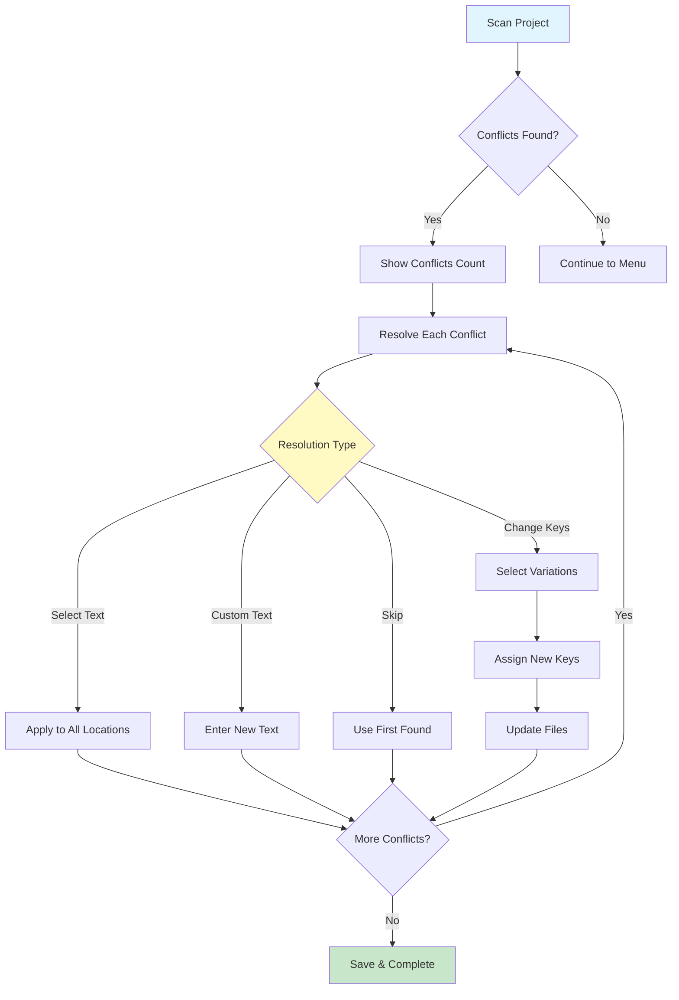
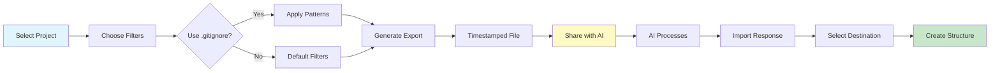

# Interactive Project Tool v4.4

<div align="center">


**🚀 A powerful CLI tool that revolutionizes project management by combining export/import capabilities with advanced translation management, designed for seamless AI collaboration.**

[✨ Features](#-key-features) • [📦 Installation](#-installation) • [🎮 Usage](#-usage) • [🌐 Translation](#-translation-management) • [⚙️ Settings](#-settings) • [🤖 AI Integration](#-claude-ai-integration) • [💡 Examples](#-examples--workflows)

</div>

---

## 🎯 Key Features

### 📤📥 **Advanced Project Export/Import**
<details>
<summary>Click to expand details</summary>

- **Smart Export**: Convert entire projects to single shareable files
- **Intelligent Import**: Advanced directory selection with preview
- **Custom Filtering**: Use `.projecttoolignore` for project-specific patterns
- **Gitignore Support**: Option to inherit patterns from `.gitignore`
- **Timestamped Files**: Full date/time with seconds for precise tracking
- **Cross-Platform**: Seamless operation on Windows, macOS, and Linux
</details>

### 🌳 **Tree Structure Creation**
<details>
<summary>Click to expand details</summary>

- **ASCII to Reality**: Transform text diagrams into actual folder structures
- **Smart Parsing**: Handles complex nested structures with various formats
- **Workspace Creation**: Auto-generate parent workspace folders
- **Validation**: Preview structure before creation
- **Flexible Destinations**: Choose exact location with browsing
</details>

### 🗑️ **Advanced File Management**
<details>
<summary>Click to expand details</summary>

- **Export File Manager**: Clean up accumulated export files efficiently
- **Batch Operations**: Multi-select with Space key, select all with 'A'
- **Smart Filtering**: Auto-filters to show only relevant export files
- **Full Timestamps**: Complete date/time display with seconds
- **Safe Deletion**: Multiple confirmation levels prevent accidents
- **Auto-cleanup**: Set maximum file limits with automatic rotation
</details>

### 🌐 **Revolutionary Translation Management**
<details>
<summary>Click to expand details</summary>

- **Complete i18n Setup**: Create translation infrastructure from scratch
- **14 Language Support**: EN, AR, ES, FR, DE, IT, PT, RU, ZH, JA, KO, HI, FA, UR
- **Smart Pattern Detection**: Including optional chaining (`t?.key`)
- **AI-Powered Translation**: OpenAI GPT-3.5, Google Translate, MyMemory
- **Advanced Conflict Resolution**:
  - Intelligent text grouping regardless of quote types
  - Dynamic key renaming for variations
  - Save/exit at any point with Ctrl+C
  - Progress tracking and state persistence
  - Automatic file updates with new keys
- **Perfect Synchronization**: Keep all language files in sync
- **TypeScript Support**: Auto-generate and maintain type definitions
- **Professional Reports**: HTML, Markdown, JSON, CSV formats
</details>

### ⚙️ **Comprehensive Settings System**
<details>
<summary>Click to expand details</summary>

- **Categorized Settings**: Organized menu for easy navigation
- **IDE Integration**: Support for VS Code, Sublime, Atom, WebStorm, Trae
- **File Manager Options**: Configure preferred folder browsers
- **Export Customization**: Custom paths, prefixes, patterns
- **Translation Settings**: API preferences, report formats, backups
- **Display Options**: Verbosity, progress bars, themes
- **Persistent Configuration**: All settings saved between sessions
</details>

### 🤖 **AI Assistant Integration**
<details>
<summary>Click to expand details</summary>

- **Claude AI Optimized**: Designed for AI collaboration
- **Structured Export**: Special format for AI analysis
- **Seamless Import**: Direct import of AI modifications
- **Clean Output**: No metadata or unnecessary formatting
</details>

---

## 📊 Workflow Diagrams

### Translation Conflict Resolution Flow


### Export/Import Process


---

## 📦 Installation

### Method 1: NPM Global Install (Recommended)
```bash
npm install -g interactive-project-tool

# Verify installation
project-tool --version
```

### Method 2: From Source
```bash
# Clone repository
git clone https://github.com/AliSaadat-ir/interactive-project-tool.git
cd interactive-project-tool

# Install globally
npm install -g .

# Run
project-tool
```

### Method 3: Development Mode
```bash
# Clone for development
git clone https://github.com/AliSaadat-ir/interactive-project-tool.git
cd interactive-project-tool

# Run directly without global install
node index.js

# Or make executable
chmod +x index.js
./index.js
```

### System Requirements
- **Node.js**: 14.0.0 or higher
- **NPM**: 6.0.0 or higher
- **OS**: Windows 10+, macOS 10.14+, Linux (Ubuntu 18.04+)
- **Terminal**: Any modern terminal with UTF-8 support

---

## 🎮 Usage

### Command Line Interface
```bash
# Interactive mode (default)
project-tool

# Quick commands
project-tool --help         # Show help
project-tool --version      # Show version
project-tool --setup        # Setup API keys
project-tool --sync         # Sync translations
project-tool --check        # Check consistency
```

### Navigation Controls
| Key | Action | Context |
|-----|--------|---------|
| ↑ ↓ | Navigate menu | All menus |
| 1-9 | Quick select | Numbered items |
| Enter | Confirm | All menus |
| Space | Toggle selection | Multi-select |
| A | Select/deselect all | Multi-select |
| Ctrl+C | Save & Exit options | Conflict resolution |
| Esc | Back/Cancel | Sub-menus |

---

## 🌐 Translation Management

### Pattern Detection
The tool detects all modern JavaScript/TypeScript translation patterns:

```javascript
// Standard patterns
t.welcomeMessage
t['userProfile']
t["navigation.home"]

// Optional chaining (ES2020+)
t?.welcomeMessage
t?.['userProfile']
t?.nav?.home

// With fallback text (source of truth)
t.welcomeMessage || 'Welcome to our app'
{t?.loadingMessage || 'Loading...'}

// Vue.js style
$t.welcomeMessage
$t('navigation.home')

// Function patterns
translation('welcomeMessage')
translate('nav.home')
```

### Advanced Conflict Resolution

#### State Persistence
- **Auto-save**: Progress saved after each resolution
- **Resume**: Continue from where you left off
- **Session Management**: 1-hour session timeout

#### Resolution Options
1. **Select Preferred Text**: Apply to all occurrences
2. **Change Keys**: Assign different keys to variations
3. **Custom Text**: Enter your own translation
4. **Skip**: Use first found text

#### Key Renaming Flow
```
Original: loginToContinue
Conflicts: 
  - "Please log in to continue" (3 locations)
  - "Login required to continue" (2 locations)

Resolution:
  - loginToContinue → "Please log in to continue"
  - loginToContinueAlt → "Login required to continue"
```

### Translation Reports

#### HTML Report Features
- **Interactive Dashboard**: Health score visualization
- **Progress Bars**: Visual coverage per language
- **Priority Recommendations**: Color-coded action items
- **Usage Statistics**: Most/least used keys
- **Export Options**: Print or save as PDF

#### Report Formats
| Format | Use Case | Features |
|--------|----------|----------|
| HTML | Visual analysis | Charts, interactive |
| Markdown | Documentation | Human-readable |
| JSON | Integration | Machine-readable |
| CSV | Spreadsheets | Data analysis |

---

## ⚙️ Settings

### Settings Categories

#### 🌐 Translation Settings
```javascript
{
  "defaultTranslationApi": "auto",    // auto, openai, google, mymemory
  "translationReportFormat": "both",   // markdown, json, both
  "autoBackupBeforeSync": true,        // Backup before sync
  "openHtmlInBrowser": true           // Auto-open HTML reports
}
```

#### 📂 File & Folder Settings
```javascript
{
  "autoOpenReports": true,            // Open reports after generation
  "openFolderInsteadOfFile": false,   // Open containing folder
  "preferredIde": "auto",             // auto, code, subl, atom, trae
  "preferredFileManager": "auto",     // auto, explorer, finder
  "showHiddenFiles": false,           // Show hidden files in browser
  "useProjectToolIgnore": true        // Use .projecttoolignore
}
```

#### 📤 Export/Import Settings
```javascript
{
  "customExportPath": "",             // Default export location
  "exportFilePrefix": "export",       // Export file prefix
  "maxExportFiles": 50,               // Auto-cleanup limit
  "confirmBeforeDelete": true,        // Deletion confirmations
  "excludePatterns": []               // Custom exclusion patterns
}
```

---

## 🤖 Claude AI Integration

### Optimized Workflow

#### 1. Export Your Project
```bash
project-tool
> Export Project
> Select directory
> Choose .gitignore usage
# Creates: export_20250804_142532.txt
```

#### 2. Claude AI Prompt
```text
You are a code-export assistant that produces a single text file summarizing 
project structure and code contents.

Output requirements:
1. For each included file, insert:
   // File: relative/path/to/file
   (then the entire content of that file)

2. After all files, insert:
   // === Folder Tree ===
   Then a tree diagram using ASCII markers

3. Excluded: node_modules, .git, dist, build, .next, .vscode, 
   .gitignore, package-lock.json

4. Output must be plain text in one file, no additional commentary.

Please analyze this codebase and suggest improvements.
```

#### 3. Import Claude's Response
```bash
project-tool
> Import Project
> Select Claude's response file
> Create new folder (recommended)
> Confirm and import
```

---

## 💡 Examples & Workflows

### Complete Translation Setup
```bash
# For new project without i18n
project-tool
> Manage Translations
> Create Translation Structure
> Select languages (Space to toggle)
> Choose location (lib/translations)
> Confirm creation

# Result:
lib/translations/
├── index.ts
├── types.ts
└── languages/
    ├── en.ts
    ├── ar.ts
    ├── es.ts
    └── fr.ts
```

### Conflict Resolution with State
```bash
# Start resolution
project-tool
> Manage Translations
> Scan Project
# Found 5 conflicts

> Resolve conflicts
# Resolve 3 conflicts

# Press Ctrl+C
> Save progress and exit

# Later...
project-tool
> Manage Translations
> Resolve conflicts
# Continues from conflict 4 of 5
```

### Custom Ignore Patterns
Create `.projecttoolignore`:
```gitignore
# Custom patterns for project tool
*.test.js
*.spec.ts
__tests__/
coverage/
*.log
temp/
.env.local
.env.production

# Specific files
config/secrets.json
data/private/
```

### Batch Export Cleanup
```bash
project-tool
> Manage Export Files
> Delete Multiple Files
# Press 'A' to select all old files
# Or Space to select specific files
> Confirm deletion
```

---

## 🔧 Advanced Configuration

### Environment Setup
The tool uses a dedicated `.env` file in the installation directory:

```bash
# Location varies by installation method
~/.npm-global/lib/node_modules/project-tool/.env
# or
/usr/local/lib/node_modules/project-tool/.env

# Content:
OPENAI_API_KEY=sk-your-key-here
GOOGLE_TRANSLATE_API_KEY=your-google-key
```

### Custom IDE Commands
```javascript
// In settings
{
  "preferredIde": "/usr/local/bin/my-editor"
}
```

### API Priority System
1. **User Preference**: Your configured default
2. **Auto Selection**: OpenAI → Google → MyMemory
3. **Fallback**: Always falls back to free API

---

## 🐛 Troubleshooting

### Common Issues & Solutions

#### Translation Conflicts Persist
**Problem**: Conflicts reappear after resolution
**Solution**: 
- Ensure you're not skipping conflicts
- Check that files have write permissions
- Clear state with: `rm .translation-conflicts-state.json`

#### IDE Not Opening Files
**Problem**: Files don't open in preferred editor
**Solution**:
```bash
# Add to PATH or use full path
project-tool > Settings > File Settings
> Preferred IDE: /full/path/to/editor
```

#### Export Files Not Found
**Problem**: Import can't find export files
**Solution**: Files must have "export" in name and .txt extension

#### Module Not Found Errors
**Problem**: `Cannot find module '../date'`
**Solution**: Update to latest version or reinstall

### Debug Mode
```bash
# Enable verbose logging
project-tool > Settings > Display Settings
> Show detailed logs: Enabled

# Or with Node.js debug
DEBUG=* node index.js
```

---

## 🤝 Contributing

We welcome contributions! Areas for improvement:

### Priority Areas
- **Translation APIs**: Add DeepL, Microsoft Translator
- **IDE Support**: Add support for more editors
- **Pattern Detection**: Support for more frameworks
- **Performance**: Optimize for very large projects
- **Testing**: Comprehensive test suite needed

### Development Setup
```bash
# Fork and clone
git clone https://github.com/your-username/interactive-project-tool.git
cd interactive-project-tool

# Create feature branch
git checkout -b feature/amazing-feature

# Make changes and test
npm test  # Coming soon

# Submit PR
git push origin feature/amazing-feature
```

---

## 📝 License

This project is licensed under the MIT License - see the [LICENSE](LICENSE) file for details.

---

## 🆘 Support

### Quick Links
- 📋 [GitHub Issues](https://github.com/AliSaadat-ir/interactive-project-tool/issues)
- 💬 [Discussions](https://github.com/AliSaadat-ir/interactive-project-tool/discussions)
- 📚 [Wiki](https://github.com/AliSaadat-ir/interactive-project-tool/wiki)
- 🐛 [Bug Reports](https://github.com/AliSaadat-ir/interactive-project-tool/issues/new?template=bug_report.md)
- ✨ [Feature Requests](https://github.com/AliSaadat-ir/interactive-project-tool/issues/new?template=feature_request.md)

### Community
- Star the project to show support
- Share your use cases in Discussions
- Contribute translations for more languages

---

## 🔄 Latest Updates (v4.4.0)

### 🎉 Major Enhancements
- ✨ **State Persistence**: Save/resume conflict resolution anytime
- ✨ **Custom Ignore**: `.projecttoolignore` for project-specific patterns
- ✨ **Enhanced Reports**: HTML reports with browser auto-open
- ✨ **Better Timestamps**: Full date/time with seconds
- 🐛 **Fixed**: Path resolution in types.js
- 🐛 **Fixed**: Persistent conflicts after resolution
- 🔧 **Improved**: Settings now properly loaded everywhere

### 🚀 Coming Soon
- [ ] Test suite with 90%+ coverage
- [ ] Plugin system for custom extensions
- [ ] Cloud sync for settings
- [ ] GUI version for non-technical users
- [ ] API for programmatic usage

---

<div align="center">

**Made with ❤️ by developers, for developers collaborating with AI**

[⭐ Star this project](https://github.com/AliSaadat-ir/interactive-project-tool) • [🐛 Report Bug](https://github.com/AliSaadat-ir/interactive-project-tool/issues) • [💡 Request Feature](https://github.com/AliSaadat-ir/interactive-project-tool/issues)

</div>